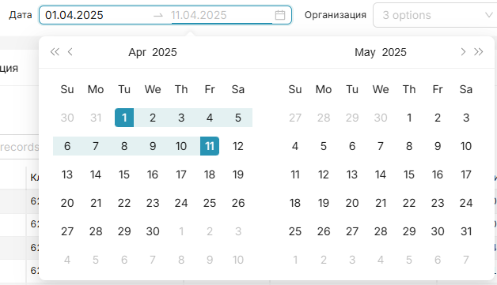

# superset-plugin-filter-calendar

A date range filter plugin for Apache Superset. A single input field opens two side-by-side calendars on click. Selecting one date filters by that day; selecting two dates filters by the range.



## Features

- **Single date** - click one date = filter by that day
- **Date range** - pick start and end dates across two calendars
- Display format `DD.MM.YYYY`
- Works as a Native Filter in Superset dashboards
- No datasource required (`datasourceCount: 0`)
- Passes `time_range` via `extraFormData` to filter charts

## Installation

### Option 1: Automatic (script)

```bash
# 1. Clone the repository
git clone https://github.com/Sque-ak/sfcalendarpicker.git
cd sfcalendarpicker

# 2. Run the install script, pointing to your superset-frontend
sudo bash install.sh /path/to/superset-frontend
```

The script will:

1. Copy the plugin to `superset-frontend/packages/sfcalendarpicker/`
2. Add the dependency `"sfcalendarpicker": "file:./packages/sfcalendarpicker"` to `package.json`
3. Patch `MainPreset` - add the import and register `SimpleCalendarFilterPlugin` with key `filter_calendar`
4. Run `npm install --legacy-peer-deps && npm run build`

```bash
# 3. Restart Superset
sudo systemctl restart superset
# or for Docker:
docker restart superset
```

### Option 2: Manual

```bash
FRONTEND=/path/to/superset-frontend

# Copy the package
cp -r . $FRONTEND/packages/sfcalendarpicker

# Add the dependency to $FRONTEND/package.json:
#   "sfcalendarpicker": "file:./packages/sfcalendarpicker"

# Register the plugin in MainPreset
node scripts/register-plugin.js $FRONTEND

# Build the frontend
cd $FRONTEND
npm install --legacy-peer-deps
npm run build
```

### Option 3: Docker (multi-stage build)

If Superset runs in Docker, you can add the plugin during the image build:

```dockerfile
FROM apache/superset:6.1.0rc1 AS build
USER root

# Install Node.js 20
RUN apt-get update && apt-get install -y curl \
    && curl -fsSL https://deb.nodesource.com/setup_20.x | bash - \
    && apt-get install -y nodejs

# Clone the plugin
RUN git clone https://github.com/Sque-ak/sfcalendarpicker.git /tmp/sfcalendarpicker

# Install the plugin and rebuild the frontend
RUN cd /tmp/sfcalendarpicker && bash install.sh /app/superset-frontend

FROM apache/superset:6.1.0rc1
COPY --from=build /app/superset/static /app/superset/static
```

```bash
docker build -t superset-with-calendar .
```

> **Note:** Building the Superset frontend takes significant time and memory (≥8 GB RAM recommended).

## Usage

1. Open a dashboard → click **⚙** (Settings) → **Filters**
2. Click **+ Add filter**
3. In the **Filter Type** dropdown select **"Calendar Date"**
4. Set the **Scope** — which charts this filter applies to
5. Click **Save**

The filter will appear in the filter bar as a single date field. Clicking it opens a popup with two calendars. Select a date range and charts will update automatically.

## How it works

The component uses the `antd` `RangePicker`. When dates are selected it calls `setDataMask`:

```js
setDataMask({
  extraFormData: { time_range: "2026-03-01 : 2026-03-19" },
  filterState: {
    value: ["2026-03-01", "2026-03-18"],
    label: "01.03.2026 — 18.03.2026",
  },
});
```

- `time_range` is passed to chart SQL queries as a `WHERE ... BETWEEN` condition
- The end date is shifted by +1 day (`end.add(1, "day")`) to include the entire last day
- When a single date is selected, `start` and `end` are the same

## Dependencies

All dependencies are already bundled with Superset — no extra packages required:

| Package                       | Purpose                                    |
| ----------------------------- | ------------------------------------------ |
| `@superset-ui/core`           | `ChartPlugin`, `ChartMetadata`, `Behavior` |
| `@superset-ui/chart-controls` | Types for `controlPanel`                   |
| `antd`                        | `DatePicker.RangePicker` — UI component    |
| `dayjs`                       | Date manipulation                          |
| `react`                       | React 16/17/18                             |

## Compatibility

Tested on **Apache Superset 6.1.0rc1** (Docker, Debian).
